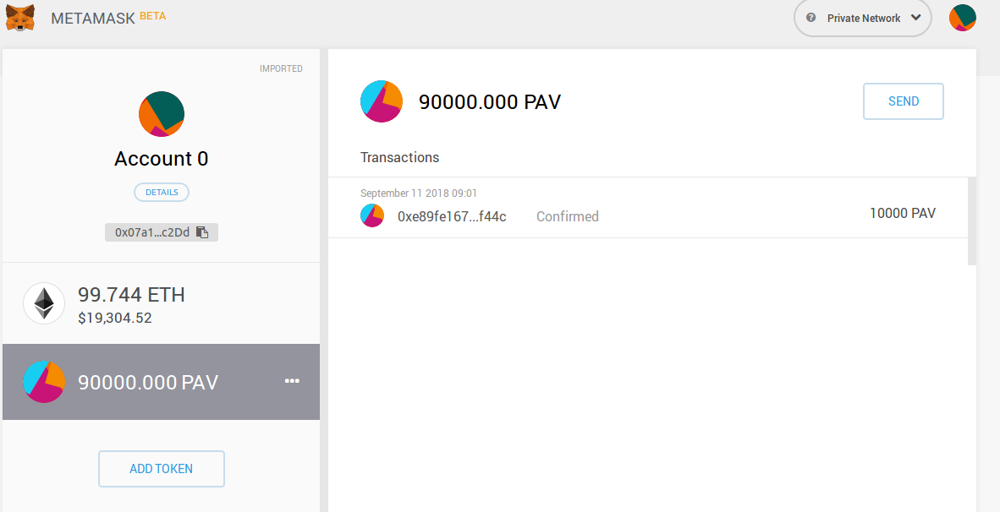

# Módulo 1 - Fundamentos y Herramientas

## JavaScript API para Ethereum
Utilizar la librería de JavaScript-API de Ethereum para conectar con nuestra blockchain en local, mediante el uso de truffle console.

### Comprobar que existe conexión a un nodo.

```
truffle(development)> web3.isConnected()
true
```

### Comprobar si está o no sincronizando nuevos bloques. ¿Por qué?
```
truffle(development)> web3.eth.syncing
false
```
Aparentemente nos dice que no está sincronizando nuevos bloques pero la razón es que tenemos configurado ganache para que no cree bloques de forma automática, si no que solo se creen cuando haya transacciones.

### Balance de la cuenta que ha desplegado el contrato en la blockchain.
```
truffle(development)> web3.fromWei(web3.eth.getBalance(web3.eth.accounts[0]).toNumber())
'99.1847649'
```

### Address de la cuenta número 3 de Ganache o ganache-cli.
```
truffle(development)> web3.eth.accounts[2]
'0x0473a5f3929e09c5ebec424ad5991c50010dbfe4'
```

### Número de bloque en el que se encuentra la blockchain en ese instante. ¿Por qué?
```
truffle(development)> web3.eth.blockNumber
14
```
Hemos utilizado nuestro blockchain local de ganache para hacer el ejemplo de pet-shop por lo que hemos realizado transacciones que han ido generando nuevos bloques.

### Dirección del host de la blockchain.
```
truffle(development)> web3.currentProvider
HttpProvider {
  host: 'http://127.0.0.1:8545',
  timeout: 0,
  user: undefined,
  password: undefined,
  headers: undefined,
  send: [Function],
  sendAsync: [Function],
  _alreadyWrapped: true }
```
La dirección es localhost con el puerto que tiene ganache-cli por defecto

### Acceda a ethgasstation y convierta el precio del gas en ese instante a Ether.
El precio que nos indica ethgasstation a día 9 de septiembre a las 09:00 es de 3.6 Gwei, que traducido a ether es:
```
truffle(development)> web3.fromWei(web3.toWei(3.6, 'gwei'))
'0.0000000036'
```

## Ejercicios de Solidity con Remix

### Issue your token
Este ejemplo muestra cómo podemos crear tokens en Ethereum, ofreciéndonos el código y explicándolo brevemente.
Hay varios ejemplos de tokens, del más sencillo que permite solamente transferir al más complejo que permite acciones avanzadas como congelar cuentas, acuñar nuevos tokens, cambiar de owner, etc.
He ido pegando cada uno de ellos en Remix y posteriormente haciendo el Deploy en nuestra blockchain local de Ganache que tenemos conectada con Metamask.
Comentar que uno de los avisos de warning que nos salen es el de cambiar la función contructor de "function <contract_name>" a "constructor", ya que lo hace más seguro por si cometiéramos un bug de typo que fuera catastrófico.
Con el modelo avanzado he hecho un deploy de un nuevo token, llamado "Mortadelo", con símbolo MRTD y un supply de 1000. A continuación he hecho algunas transferencias utilizando las funciones disponibles del contrato en Remix. En concreto el envío de 2 MRTD a otra de las cuentras disponibles en nuestra blockchain.


### Crowdsale
Para este caso he copiado el código y he hecho el deploy con un token creado anteriormente, que es la dirección que pongo en addressOfTokenUsedAsReward.
Le paso unos tokens a dicho contract y con las otras cuentas de ganache envío ethers, através de Metamask. Comentar que hay algún bug con esto porque lo he tenido que intentar varias veces ya que en ocasiones sale un error de "Error rpc with paylod". Efectivamente veo que la cantidad recaudada mediante el método amountRaised coincide con lo que he enviado pero no consigo que le lleguen los tokens a las cuentas que han pagado los ethers. Consultando con el método balanceOf veo lo que ha enviado una de las cuentas, pero lo que no consigo ver son los tokens que supuestamente deberían haber recibido.
Una vez que se ha terminado el deadline al querer hacer el safe withdrawal para pasar los fondos recogidos tampoco consigo obtnerlos, a pesar que sí se ha cumplido el funding goal y que lo hago desde la dirección que es el dueño del smart contract.
Conclusión que se me han perido unos Ethers en mi blockchain.

### DAO
He hecho el deploy del Congress pero no he hehco mucho más ya que no sabía como hacer lo de watch contract con Remix. Además el nivel de este smartcontract lo he visto ya un poco más complicado de poder seguirlo.
Aún así he ido añadiendo members al contrato para luego consultarlos.


## Ejercicios de Solidity con Truffle
Para este caso hemos iniciado un nuevo proyecto con: ```truffle init```
Una vez que tenemos los directorios creados copiamos el contenido de los smartcontracts que habíamos utilizado en Remix y pasamos a compilarlos con truffle compile:

```
rggentil@elcid:~/Documents/diseño_y_desarrollo/modulo1b$ truffle compile
Compiling ./contracts/AdvanceToken.sol...
Compiling ./contracts/Congress.sol...
Compiling ./contracts/Crowdsale.sol...
Compiling ./contracts/Migrations.sol...
Compiling ./contracts/TokenERC20.sol...

Compilation warnings encountered:

/home/rggentil/Documents/diseño_y_desarrollo/modulo1b/contracts/Congress.sol:6:5: Warning: Defining constructors as functions with the same name as the contract is deprecated. Use "constructor(...) { ... }" instead.
    function owned()  public {
    ^ (Relevant source part starts here and spans across multiple lines).
,/home/rggentil/Documents/diseño_y_desarrollo/modulo1b/contracts/Congress.sol:184:26: Warning: This function only accepts a single "bytes" argument. Please use "abi.encodePacked(...)" or a similar function to encode the data.
        p.proposalHash = keccak256(beneficiary, weiAmount, transactionBytecode);
                         ^----------------------------------------------------^
,/home/rggentil/Documents/diseño_y_desarrollo/modulo1b/contracts/Congress.sol:236:34: Warning: This function only accepts a single "bytes" argument. Please use "abi.encodePacked(...)" or a similar function to encode the data.
        return p.proposalHash == keccak256(beneficiary, weiAmount, transactionBytecode);
                                 ^----------------------------------------------------^
,/home/rggentil/Documents/diseño_y_desarrollo/modulo1b/contracts/Congress.sol:284:34: Warning: This function only accepts a single "bytes" argument. Please use "abi.encodePacked(...)" or a similar function to encode the data.
            && p.proposalHash == keccak256(p.recipient, p.amount, transactionBytecode)  // and the supplied code matches the proposal
                                 ^---------------------------------------------------^

Writing artifacts to ./build/contracts
```

Nos salen algunos warnings pero los vamos a obviar porque sabemos el código funciona del anterior apartado con Remix.

Configuramos en truffle.js el puerto de ganache-cli, el 8545, y pasamos a hacer el deploy de los contratos mediante truffle migration. Para ello antes tenemos que crear otros dos ficheros de migración, uno para el contract del token a crear y a continuación el del Crowdsale. Hacemos la migración primero de el del token porque necesitaremos el address de este contract para añadirlo en el deploy del corwdsale. Estos dos dicheros los podemos encontrar en:
https://github.com/rggentil/dise-o_y_desarrollo/modulo1/2_next_migration.js
https://github.com/rggentil/dise-o_y_desarrollo/modulo1/3_next_migration.js

Hacemos la migración a nuestra blockchain local:

```
rggentil@elcid:~/Documents/diseño_y_desarrollo/modulo1b$ truffle migrate
Using network 'development'.

Running migration: 1_initial_migration.js
  Deploying Migrations...
  ... 0x11f6f8886b780f3a33ead70ed2af8faf7c9c7ff1364393f146ecaa3a37891389
  Migrations: 0x102cbf59c23592d19f5cc0511dcf88bc97d5a7c6
Saving successful migration to network...
  ... 0x550544c383ab838522f151a55005d2449bdccbd7eb0a18bad4ce628d73191ee9
Saving artifacts...
Running migration: 2_next_migration.js
  Deploying TokenERC20...
  ... 0x438bc9e44cee7527810acafc98ad1314f1e39df95a7e791acae11f5568358eb2
  TokenERC20: 0xe89fe16758eff82a9f7ebf7812101d354922f44c
Saving successful migration to network...
  ... 0x4b042948563c1a18b0616a16a56e854cbe5f72a5362efc5b7dcb7c83efda73dc
Saving artifacts...

rggentil@elcid:~/Documents/diseño_y_desarrollo/modulo1b$ truffle migrate
Using network 'development'.

Running migration: 3_next_migration.js
  Deploying Crowdsale...
  ... 0x32a9775b7f3a54b28060fae475dcb19174966fdaf8dd0451db174a6dd871c740
  Crowdsale: 0x9ef7479ad6fe26c88722dbcc627dbadafa60286d
Saving successful migration to network...
  ... 0x4a718beec85362d14e3e9a9f2a68879ac19607773b8aba5188860d200231d326
Saving artifacts...
```

Ya tenemos nuestros smartcontracts desplegados. Ahora con Metamask podemos ver el nuevo token creado y hacer transferencias de dicho token:



He intentado hacer la transferencia de tokens al contract de Crowdsale pero me ha sido imposible ya que me salía todo el rato el error de Metamask que he descrito anteriormente. En esta ocasión no he sido capaz de que me entrara una orden bien así que no he podido probar la feature de Crowdsale.

No obstante he podido mirar algunas cosas de Crowdsale desde truffle console:

```
truffle(development)> Crowdsale.address
'0x9ef7479ad6fe26c88722dbcc627dbadafa60286d'
truffle(development)> Crowdsale.at('0x9ef7479ad6fe26c88722dbcc627dbadafa60286d').deadline()
BigNumber { s: 1, e: 9, c: [ 1536650175 ] }
truffle(development)> Crowdsale.at('0x9ef7479ad6fe26c88722dbcc627dbadafa60286d').balanceOf("0x07a12155d00623fb3270167f42b66e23f014c2dd")
BigNumber { s: 1, e: 0, c: [ 0 ] }
truffle(development)> Crowdsale.at('0x9ef7479ad6fe26c88722dbcc627dbadafa60286d').amountRaised()
BigNumber { s: 1, e: 0, c: [ 0 ] }
truffle(development)> Crowdsale.at('0x9ef7479ad6fe26c88722dbcc627dbadafa60286d').price()
BigNumber { s: 1, e: 18, c: [ 10000 ] }
```

También he utilizado truffle console para jugar con el contract de Token y hacer algunas transferencias. Comentar que a pesar de esta transferencia hecha no lo veo reflejado en Metamask.

```
truffle(development)> TokenERC20.address
'0xe89fe16758eff82a9f7ebf7812101d354922f44c'
truffle(development)> TokenERC20.address.at('0xe89fe16758eff82a9f7ebf7812101d354922f44c').decimals()
TypeError: TokenERC20.address.at is not a function
truffle(development)> TokenERC20.at('0xe89fe16758eff82a9f7ebf7812101d354922f44c').decimals()
BigNumber { s: 1, e: 1, c: [ 18 ] }
truffle(development)> TokenERC20.at('0xe89fe16758eff82a9f7ebf7812101d354922f44c').transfer(0xEEb17e5933CABB1edb2FbdFD7D301B62A6043b20, 5000)
{ tx: '0x1d20f219c5048b65dc7e34ea01eea5004c4c21d6be26f811b0c5ffccf6f3a30d',
  receipt: 
   { transactionHash: '0x1d20f219c5048b65dc7e34ea01eea5004c4c21d6be26f811b0c5ffccf6f3a30d',
     transactionIndex: 0,
     blockHash: '0x124dd68050f81620743250a5f319298a31391fc49a90d810e721ae43c97817d7',
     blockNumber: 15,
     gasUsed: 52893,
     cumulativeGasUsed: 52893,
     contractAddress: null,
     logs: [ [Object] ],
     status: '0x1',
     logsBloom: '0x00000000000000000000000000000000000000000000000000000100000000000000000000000000000000000002004000000000000000000000000000000000000000000000000000000008000000000000000000000000000000000000000000000000000000000000000000000000000000000000000000000010000000000000000000000000000000000000000000000000000000000000000000000000000000000000000000000000000000000080000000040000000000000000000000000002000000000000000000000000000100000000000004000000000080000000000000000000000000000000000000000080000000000000000000000000' },
  logs: 
   [ { logIndex: 0,
       transactionIndex: 0,
       transactionHash: '0x1d20f219c5048b65dc7e34ea01eea5004c4c21d6be26f811b0c5ffccf6f3a30d',
       blockHash: '0x124dd68050f81620743250a5f319298a31391fc49a90d810e721ae43c97817d7',
       blockNumber: 15,
       address: '0xe89fe16758eff82a9f7ebf7812101d354922f44c',
       type: 'mined',
       event: 'Transfer',
       args: [Object] } ] }
truffle(development)> TokenERC20.at('0xe89fe16758eff82a9f7ebf7812101d354922f44c').balanceOf(0xEEb17e5933CABB1edb2FbdFD7D301B62A6043b20)
BigNumber { s: 1, e: 3, c: [ 5000 ] }
truffle(development)> TokenERC20.at('0xe89fe16758eff82a9f7ebf7812101d354922f44c').symbol()
'PAV'
```
