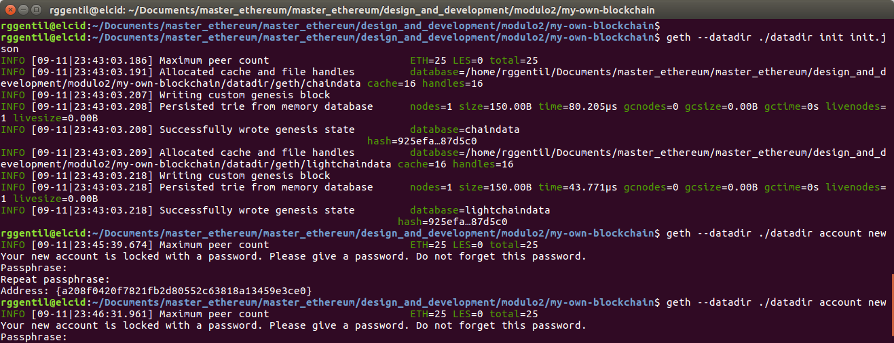
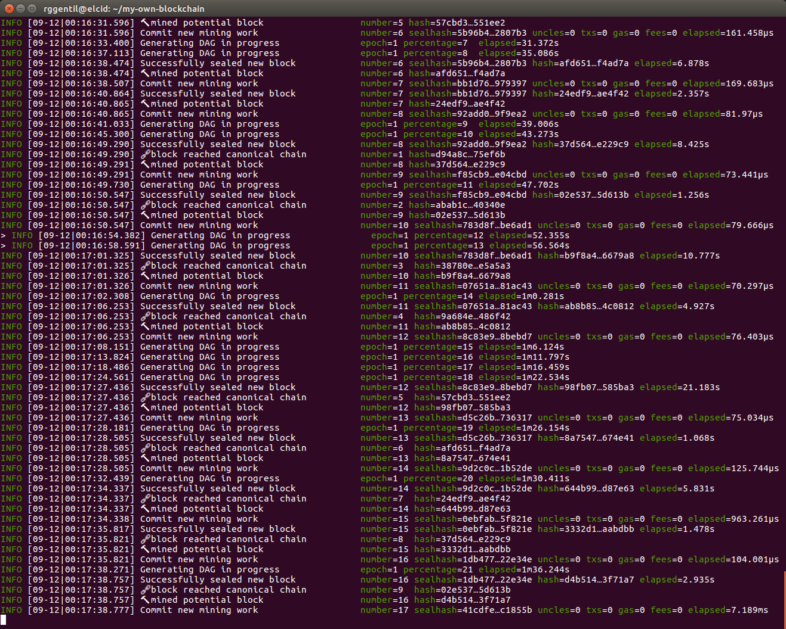
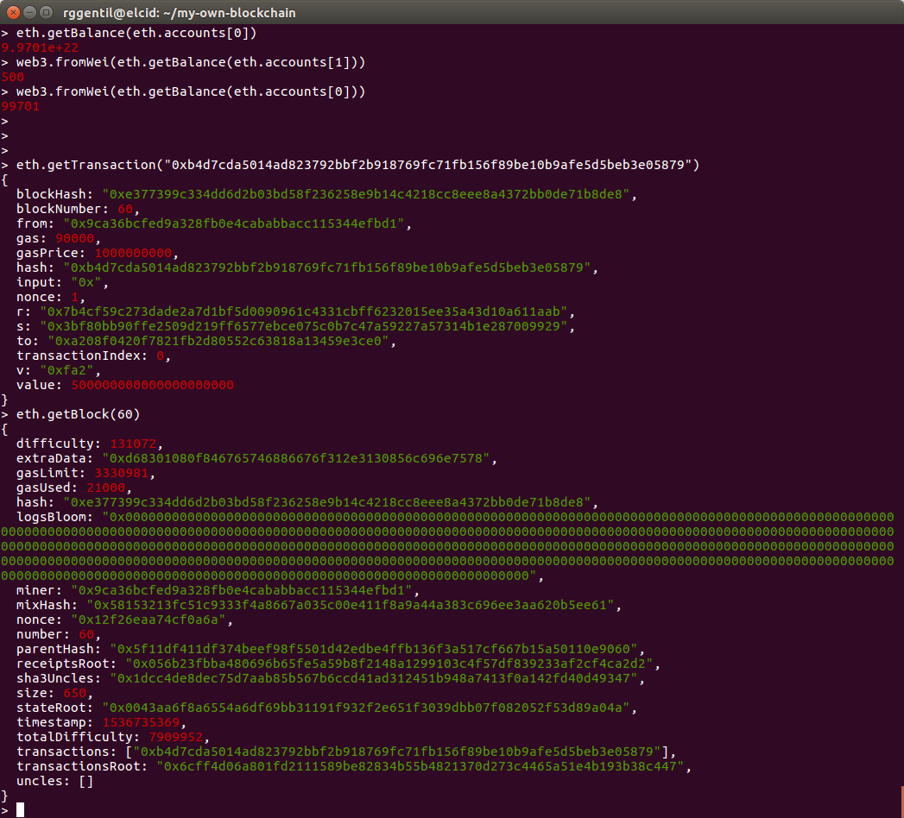
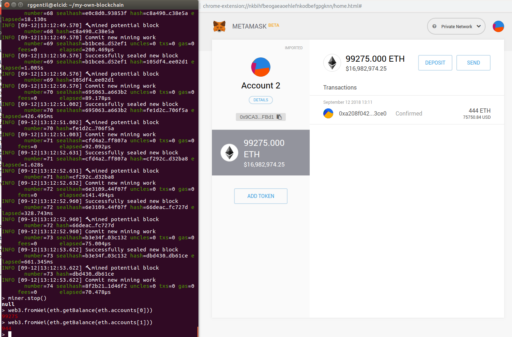

# Módulo 2 - Ejercicio 1 - Comunicación y Procesamiento

## Construya su propia blockchain

Para este ejercicio he utilizado el cliente geth como se indica. He utilizado una VM con Ubuntu 16.04 y el ciente geth es la versión 1.8.15-stable.

Comentar que para este ejercicio me he basado en dos manuales:
https://medium.com/mercuryprotocol/how-to-create-your-own-private-ethereum-blockchain-dad6af82fc9f
https://medium.com/coinmonks/ethereum-setting-up-a-private-blockchain-67bbb96cf4f1

### Inicializar nuestra blockchain

Lo primero, tenemos que configurar nuestro fichero de inicialización json de nuestra blockchain, donde se eligen algunos de los parámetros:

- chainId: id de nuestra blockchain
- allow: si queremos asignar ETHs a alguna cuenta antes de empezar. En nuestro caso asignamos 100000ETH a una cuenta creada anteriormente con MyEtherWallet.
- difficulty: la dificultad para el minado. He dejado el que venía en el ejemplo ya que parece ser lo suficiente bajo para minar fácilmente bloques con mi ordenador.
- gasLimit: el límite de gas, que también lo dejo por defecto.
- el resto de parámetros los he dejado tal como venían ya que no parece que sean demasiado importantes para una blockchain privada.

El fichero de init se encuentra en [init.json](my-own-blockchain/init.json) y lo mostramos a continuación:

```json
{
  "config": {
    "chainId": 1983,
    "homesteadBlock": 0,
    "eip155Block": 0,
    "eip158Block": 0,
    "byzantiumBlock": 0
  },

  "alloc"      : {
     "9ca36bcfed9a328fb0e4cababbacc115344efbd1": { 
          "balance": "100000000000000000000000"
     }
    },
  "difficulty" : "0x400",
  "extraData"  : "",
  "gasLimit"   : "0x2fefd8",
  "nonce"      : "0x0000000000000042",
  "mixhash"    : "0x0000000000000000000000000000000000000000000000000000000000000000",
  "parentHash" : "0x0000000000000000000000000000000000000000000000000000000000000000",
  "timestamp"  : "0x00"
  }
}
```

A continuación iniciamos la blockchain:

```bash
rggentil@elcid:~/Documents/master_ethereum/master_ethereum/design_and_development/modulo2/my-own-blockchain$ geth --datadir ./datadir init init.json
INFO [09-11|23:43:03.186] Maximum peer count                       ETH=25 LES=0 total=25
INFO [09-11|23:43:03.191] Allocated cache and file handles         database=/home/rggentil/Documents/master_ethereum/master_ethereum/design_and_development/modulo2/my-own-blockchain/datadir/geth/chaindata cache=16 handles=16
INFO [09-11|23:43:03.207] Writing custom genesis block 
INFO [09-11|23:43:03.208] Persisted trie from memory database      nodes=1 size=150.00B time=80.205µs gcnodes=0 gcsize=0.00B gctime=0s livenodes=1 livesize=0.00B
INFO [09-11|23:43:03.208] Successfully wrote genesis state         database=chaindata                                                                                                                        hash=925efa…87d5c0
INFO [09-11|23:43:03.209] Allocated cache and file handles         database=/home/rggentil/Documents/master_ethereum/master_ethereum/design_and_development/modulo2/my-own-blockchain/datadir/geth/lightchaindata cache=16 handles=16
INFO [09-11|23:43:03.218] Writing custom genesis block 
INFO [09-11|23:43:03.218] Persisted trie from memory database      nodes=1 size=150.00B time=43.771µs gcnodes=0 gcsize=0.00B gctime=0s livenodes=1 livesize=0.00B
INFO [09-11|23:43:03.218] Successfully wrote genesis state         database=lightchaindata                                                                                                                        hash=925efa…87d5c0
```


Vamos a crear un par de cuentas en nuestra blockchain

```bash
rggentil@elcid:~/Documents/master_ethereum/master_ethereum/design_and_development/modulo2/my-own-blockchain$ geth --datadir ./datadir account new
INFO [09-11|23:45:39.674] Maximum peer count                       ETH=25 LES=0 total=25
Your new account is locked with a password. Please give a password. Do not forget this password.
Passphrase: 
Repeat passphrase: 
Address: {a208f0420f7821fb2d80552c63818a13459e3ce0}

rggentil@elcid:~/Documents/master_ethereum/master_ethereum/design_and_development/modulo2/my-own-blockchain$ geth --datadir ./datadir account new
INFO [09-11|23:46:31.961] Maximum peer count                       ETH=25 LES=0 total=25
Your new account is locked with a password. Please give a password. Do not forget this password.
Passphrase: 
Repeat passphrase: 
Address: {c16ffee999b71ff0160f944be4291057b51ddf15}
```

Una vez creadas van a aparecer los ficheros json asociados en el directorio keystores. Además de estas dos direcciones creadas vamos a añadir la que hemos creado anteriormente con MEW, para lo que simplemente copiamos el fichero json que se creaba en este mismo directorio.

Iniciamos la consola de geth para interactuar con nuestra blockchain:
```bash
ggentil@elcid:~/my-own-blockchain$ geth --datadir ./datadir --networkid 1983 console 
INFO [09-11|23:57:43.926] Maximum peer count                       ETH=25 LES=0 total=25
INFO [09-11|23:57:43.927] Starting peer-to-peer node               instance=Geth/v1.8.15-stable-89451f7c/linux-amd64/go1.10
INFO [09-11|23:57:43.927] Allocated cache and file handles         database=/home/rggentil/my-own-blockchain/datadir/geth/chaindata cache=768 handles=512
INFO [09-11|23:57:43.945] Initialised chain configuration          config="{ChainID: 1983 Homestead: 0 DAO: <nil> DAOSupport: false EIP150: <nil> EIP155: 0 EIP158: 0 Byzantium: 0 Constantinople: <nil> Engine: unknown}"
INFO [09-11|23:57:43.945] Disk storage enabled for ethash caches   dir=/home/rggentil/my-own-blockchain/datadir/geth/ethash count=3
INFO [09-11|23:57:43.945] Disk storage enabled for ethash DAGs     dir=/home/rggentil/.ethash                               count=2
INFO [09-11|23:57:43.945] Initialising Ethereum protocol           versions="[63 62]" network=1983
INFO [09-11|23:57:43.945] Loaded most recent local header          number=0 hash=925efa…87d5c0 td=1024
INFO [09-11|23:57:43.945] Loaded most recent local full block      number=0 hash=925efa…87d5c0 td=1024
INFO [09-11|23:57:43.945] Loaded most recent local fast block      number=0 hash=925efa…87d5c0 td=1024
INFO [09-11|23:57:43.945] Loaded local transaction journal         transactions=0 dropped=0
INFO [09-11|23:57:43.945] Regenerated local transaction journal    transactions=0 accounts=0
INFO [09-11|23:57:43.945] Starting P2P networking 
INFO [09-11|23:57:46.075] UDP listener up                          self=enode://2a9f35083af56160d3d7940dab3112fbdf946246af32953da5376f5f1be16374d00c6f23d0977ae3cc5602be8c216607ddbcc84ad774dbd3ea4400710b917424@[::]:30303
INFO [09-11|23:57:46.076] IPC endpoint opened                      url=/home/rggentil/my-own-blockchain/datadir/geth.ipc
INFO [09-11|23:57:46.082] RLPx listener up                         self=enode://2a9f35083af56160d3d7940dab3112fbdf946246af32953da5376f5f1be16374d00c6f23d0977ae3cc5602be8c216607ddbcc84ad774dbd3ea4400710b917424@[::]:30303
Welcome to the Geth JavaScript console!

instance: Geth/v1.8.15-stable-89451f7c/linux-amd64/go1.10
INFO [09-11|23:57:46.189] Etherbase automatically configured       address=0xa208f0420f7821FB2D80552C63818a13459e3ce0
coinbase: 0xa208f0420f7821fb2d80552c63818a13459e3ce0
at block: 0 (Thu, 01 Jan 1970 01:00:00 CET)
 datadir: /home/rggentil/my-own-blockchain/datadir
 modules: admin:1.0 debug:1.0 eth:1.0 ethash:1.0 miner:1.0 net:1.0 personal:1.0 rpc:1.0 txpool:1.0 web3:1.0

>
>
```

Tengo que comentar antes que había tenido problemas a la hora de arrancar la consola porque me salía el siguiente error:
```
Fatal: Error starting protocol stack: listen unix /home/rggentil/Documents/master_ethereum/master_ethereum/design_and_development/modulo2/my-own-blockchain/datadir/geth.ipc: bind: invalid argument
```
Buscando por Internet he leído que parece ser que no puede funcionar bien si utilizamos path muy largos por asunto de crear el socket de Unix. El caso que moviéndome a un path más corto funciona correctamente.


### Consultar nuestra blockchain

Una vez arrancada la consola procedemos a realizar algunas acciones de consulta, como ver las cuentas que tenemos y sus balances.

```bash
> eth.accounts
["0x9ca36bcfed9a328fb0e4cababbacc115344efbd1", "0xa208f0420f7821fb2d80552c63818a13459e3ce0", "0xc16ffee999b71ff0160f944be4291057b51ddf15"]
> eth.accounts[0]
"0x9ca36bcfed9a328fb0e4cababbacc115344efbd1"
> eth.getBalance(eth.accounts[0])
1e+23
> web3.fromWei(eth.getBalance(eth.accounts[0]))
100000
```

Como podemos ver tenemos las tres cuentas que esperábamos y además una de ellas es la que tiene la cantidad de 100000 ETH que la habíamos asignado en el fichero init.json

Veamos el estado de nuestra blockchain:

```bash
> eth.blockNumber
0
> eth.getBlock(0)
{
  difficulty: 1024,
  extraData: "0x",
  gasLimit: 3141592,
  gasUsed: 0,
  hash: "0x925efae6cc75044727e0c4f260f7ae024b45974b5f70066e838c93b8ba87d5c0",
  logsBloom: "0x00000000000000000000000000000000000000000000000000000000000000000000000000000000000000000000000000000000000000000000000000000000000000000000000000000000000000000000000000000000000000000000000000000000000000000000000000000000000000000000000000000000000000000000000000000000000000000000000000000000000000000000000000000000000000000000000000000000000000000000000000000000000000000000000000000000000000000000000000000000000000000000000000000000000000000000000000000000000000000000000000000000000000000000000000000000",
  miner: "0x0000000000000000000000000000000000000000",
  mixHash: "0x0000000000000000000000000000000000000000000000000000000000000000",
  nonce: "0x0000000000000042",
  number: 0,
  parentHash: "0x0000000000000000000000000000000000000000000000000000000000000000",
  receiptsRoot: "0x56e81f171bcc55a6ff8345e692c0f86e5b48e01b996cadc001622fb5e363b421",
  sha3Uncles: "0x1dcc4de8dec75d7aab85b567b6ccd41ad312451b948a7413f0a142fd40d49347",
  size: 506,
  stateRoot: "0xaecc4f5c1fe7c8d6670f951f0e47ba3b94d0a21d457a03b682fb9e800182c5d4",
  timestamp: 0,
  totalDifficulty: 1024,
  transactions: [],
  transactionsRoot: "0x56e81f171bcc55a6ff8345e692c0f86e5b48e01b996cadc001622fb5e363b421",
  uncles: []
}
```
Consultamos la altura de bloque que es 0. Acabamos de arrancar la blockchain y además no se está minando actualmente por lo que es lo esperado. Como vemos podemos consultar dicho bloque.

### Minando nuestra blockchain

Ahora vamos a proceder con el minado

```bash
> miner.setEtherbase(web3.eth.accounts[0])
true
> eth.coinbase
"0xa208f0420f7821fb2d80552c63818a13459e3ce0"
```

Primero vamos a fijar la dirección de coinbase, que será donde se envíen los ethers de minado, a la misma dirección preconfigurada. A continuación arrancamos el minado:

```bash
> miner.start(1)
INFO [09-12|00:11:14.543] Updated mining threads                   threads=1
INFO [09-12|00:11:14.543] Transaction pool price threshold updated price=1000000000
null
> INFO [09-12|00:11:14.543] Commit new mining work                   number=1 sealhash=1fbca2…b03ccc uncles=0 txs=0 gas=0 fees=0 elapsed=131.907µs
INFO [09-12|00:11:17.481] Generating DAG in progress               epoch=0 percentage=0 elapsed=2.264s
INFO [09-12|00:11:19.722] Generating DAG in progress               epoch=0 percentage=1 elapsed=4.506s
INFO [09-12|00:11:22.032] Generating DAG in progress               epoch=0 percentage=2 elapsed=6.816s
...
...
INFO [09-12|00:15:58.538] Generating DAG in progress               epoch=0 percentage=98 elapsed=4m43.322s
INFO [09-12|00:16:01.275] Generating DAG in progress               epoch=0 percentage=99 elapsed=4m46.058s
INFO [09-12|00:16:01.277] Generated ethash verification cache      epoch=0 elapsed=4m46.060s
INFO [09-12|00:16:03.431] Successfully sealed new block            number=1 sealhash=1fbca2…b03ccc hash=d94a8c…75ef6b elapsed=4m48.887s
INFO [09-12|00:16:03.431] 🔨 mined potential block                  number=1 hash=d94a8c…75ef6b
INFO [09-12|00:16:03.431] Commit new mining work                   number=2 sealhash=a4d8c0…5230ae uncles=0 txs=0 gas=0 fees=0 elapsed=85.36µs
INFO [09-12|00:16:05.853] Successfully sealed new block            number=2 sealhash=a4d8c0…5230ae hash=abab1c…40340e elapsed=2.422s
INFO [09-12|00:16:05.853] 🔨 mined potential block                  number=2 hash=abab1c…40340e
INFO [09-12|00:16:05.873] Commit new mining work                   number=3 sealhash=9207a9…1b253d uncles=0 txs=0 gas=0 fees=0 elapsed=406.01µs
INFO [09-12|00:16:06.227] Generating DAG in progress               epoch=1 percentage=0  elapsed=4.199s
INFO [09-12|00:16:09.969] Generating DAG in progress               epoch=1 percentage=1  elapsed=7.942s
INFO [09-12|00:16:13.609] Generating DAG in progress               epoch=1 percentage=2  elapsed=11.582s
INFO [09-12|00:16:13.844] Successfully sealed new block            number=3 sealhash=9207a9…1b253d hash=38780e…e5a5a3 elapsed=7.970s
INFO [09-12|00:16:13.844] 🔨 mined potential block                  number=3 hash=38780e…e5a5a3
INFO [09-12|00:16:13.844] Commit new mining work                   number=4 sealhash=fa1d4e…75a65f uncles=0 txs=0 gas=0 fees=0 elapsed=88.369µs
INFO [09-12|00:16:17.750] Generating DAG in progress               epoch=1 percentage=3  elapsed=15.723s
INFO [09-12|00:16:21.809] Generating DAG in progress               epoch=1 percentage=4  elapsed=19.782s
INFO [09-12|00:16:23.612] Successfully sealed new block            number=4 sealhash=fa1d4e…75a65f hash=9a684e…486f42 elapsed=9.767s
INFO [09-12|00:16:23.612] 🔨 mined potential block                  number=4 hash=9a684e…486f42
...
```

Tarda casi 5 minutos en empezar a minar ya que durante este rato está con la acción de generar el DAG. Posteriormente se van creando bloques rápidamente en menos de unos 10 segundos, ya que la dificultad que habíamos seleccionado era baja.



Dejamos de minar con `miner.stop()` y consultamos de nuevo la altura de la blockchain:

```bash
> eth.blockNumber
23
> web3.fromWei(eth.getBalance(eth.accounts[0]))
100069
```

Observamos dos cosas: que se han minado 23 bloques y que el saldo de nuestra cuenta ha ascendido en 69 ethers, lo que significa que estamos ganando 3 eth por cada bloque minado (esto no es configurable en el init.json si no en el código del propio cliente de geth).

### Emitir transferencias

Para emitir transferencias dentro de nuestra blockchain lo podemos hacer utilizando la función sendTransaction, aunque de primeras nos vamos a encontrar un error debido a que tenemos que desbloquear nuestra cuenta. Una vez desbloqueda podemos enviar la transacción, que en este caso lo haremos desde la cuenta coinbase a otra de las creadas anteriormente:

```bash
> eth.sendTransaction({from:eth.accounts[0], to:eth.accounts[1], value: web3.toWei(500)})
Error: authentication needed: password or unlock
    at web3.js:3143:20
    at web3.js:6347:15
    at web3.js:5081:36
    at <anonymous>:1:1
> personal.unlockAccount(eth.accounts[0], "mortadelo")
true
> eth.sendTransaction({from:eth.accounts[0], to:eth.accounts[1], value: web3.toWei(500)})
INFO [09-12|08:55:59.681] Submitted transaction                    fullhash=0xb4d7cda5014ad823792bbf2b918769fc71fb156f89be10b9afe5d5beb3e05879 recipient=0xa208f0420f7821FB2D80552C63818a13459e3ce0
"0xb4d7cda5014ad823792bbf2b918769fc71fb156f89be10b9afe5d5beb3e05879"
> 
```

Una vez realizada la transacción obtenemos su hash. Si vamos a consultar de nuevo los saldos veremos que no han cambiado como a lo mejor esperaríamos. Esto es debido a que esta transacción no ha sido minada, ya que el minado estaba parado. Si queremos que se realice con éxito debemos minar de nuevo:

```bash
> miner.start(1)
INFO [09-12|08:56:09.285] Updated mining threads                   threads=1
INFO [09-12|08:56:09.285] Transaction pool price threshold updated price=1000000000
null
> INFO [09-12|08:56:09.285] Commit new mining work                   number=60 sealhash=cd05a6…95f789 uncles=0 txs=0 gas=0     fees=0       elapsed=126.218µs
INFO [09-12|08:56:09.287] Commit new mining work                   number=60 sealhash=fbc2d8…3d0fee uncles=0 txs=1 gas=21000 fees=2.1e-05 elapsed=1.910ms
INFO [09-12|08:56:14.523] Successfully sealed new block            number=60 sealhash=fbc2d8…3d0fee hash=e37739…1b8de8 elapsed=5.238s
INFO [09-12|08:56:14.523] 🔗 block reached canonical chain          number=53 hash=a756ad…8db70e
INFO [09-12|08:56:14.523] 🔨 mined potential block                  number=60 hash=e37739…1b8de8
```

Podemos ver que en la instrucción de "Commit new mining work" del bloque 60 hay una transacción (`txs=1`). Ahora sí podemos ver el saldo esperado en las cuentas y además podemos consultar tanto la transacción como verla en el bloque 60:

```bash
> web3.fromWei(eth.getBalance(eth.accounts[1]))
500
> web3.fromWei(eth.getBalance(eth.accounts[0]))
99701
> 
> eth.getTransaction("0xb4d7cda5014ad823792bbf2b918769fc71fb156f89be10b9afe5d5beb3e05879")
{
  blockHash: "0xe377399c334dd6d2b03bd58f236258e9b14c4218cc8eee8a4372bb0de71b8de8",
  blockNumber: 60,
  from: "0x9ca36bcfed9a328fb0e4cababbacc115344efbd1",
  gas: 90000,
  gasPrice: 1000000000,
  hash: "0xb4d7cda5014ad823792bbf2b918769fc71fb156f89be10b9afe5d5beb3e05879",
  input: "0x",
  nonce: 1,
  r: "0x7b4cf59c273dade2a7d1bf5d0090961c4331cbff6232015ee35a43d10a611aab",
  s: "0x3bf80bb90ffe2509d219ff6577ebce075c0b7c47a59227a57314b1e287009929",
  to: "0xa208f0420f7821fb2d80552c63818a13459e3ce0",
  transactionIndex: 0,
  v: "0xfa2",
  value: 500000000000000000000
}
> eth.getBlock(60)
{
  difficulty: 131072,
  extraData: "0xd68301080f846765746886676f312e3130856c696e7578",
  gasLimit: 3330981,
  gasUsed: 21000,
  hash: "0xe377399c334dd6d2b03bd58f236258e9b14c4218cc8eee8a4372bb0de71b8de8",
  logsBloom: "0x00000000000000000000000000000000000000000000000000000000000000000000000000000000000000000000000000000000000000000000000000000000000000000000000000000000000000000000000000000000000000000000000000000000000000000000000000000000000000000000000000000000000000000000000000000000000000000000000000000000000000000000000000000000000000000000000000000000000000000000000000000000000000000000000000000000000000000000000000000000000000000000000000000000000000000000000000000000000000000000000000000000000000000000000000000000",
  miner: "0x9ca36bcfed9a328fb0e4cababbacc115344efbd1",
  mixHash: "0x58153213fc51c9333f4a8667a035c00e411f8a9a44a383c696ee3aa620b5ee61",
  nonce: "0x12f26eaa74cf0a6a",
  number: 60,
  parentHash: "0x5f11df411df374beef98f5501d42edbe4ffb136f3a517cf667b15a50110e9060",
  receiptsRoot: "0x056b23fbba480696b65fe5a59b8f2148a1299103c4f57df839233af2cf4ca2d2",
  sha3Uncles: "0x1dcc4de8dec75d7aab85b567b6ccd41ad312451b948a7413f0a142fd40d49347",
  size: 650,
  stateRoot: "0x0043aa6f8a6554a6df69bb31191f932f2e651f3039dbb07f082052f53d89a04a",
  timestamp: 1536735369,
  totalDifficulty: 7909952,
  transactions: ["0xb4d7cda5014ad823792bbf2b918769fc71fb156f89be10b9afe5d5beb3e05879"],
  transactionsRoot: "0x6cff4d06a801fd2111589be82834b55b4821370d273c4465a51e4b193b38c447",
  uncles: []
}
> 
```



### Añadiendo nuevos peers

A continuación vamos a intentar añadir nuevos pares a nuestra red blockchain. Primero inicializamos igual que antes utilizando el mismo fichero init.json pero ahora eligiendo un nuevo directorio. Luego arrancamos la consola con el mismo network id y utilizando un puerto difrerente:

```bash
rggentil@elcid:~/my-own-blockchain$ geth --datadir datadir_2 --networkid 1983 --port 30304    console
INFO [09-12|11:11:27.796] Maximum peer count                       ETH=25 LES=0 total=25
INFO [09-12|11:11:27.796] Starting peer-to-peer node               instance=Geth/v1.8.15-stable-89451f7c/linux-amd64/go1.10
INFO [09-12|11:11:27.796] Allocated cache and file handles         database=/home/rggentil/my-own-blockchain/datadir_2/geth/chaindata cache=768 handles=512
INFO [09-12|11:11:27.830] Initialised chain configuration          config="{ChainID: 1983 Homestead: 0 DAO: <nil> DAOSupport: false EIP150: <nil> EIP155: 0 EIP158: 0 Byzantium: 0 Constantinople: <nil> Engine: unknown}"
INFO [09-12|11:11:27.830] Disk storage enabled for ethash caches   dir=/home/rggentil/my-own-blockchain/datadir_2/geth/ethash count=3
INFO [09-12|11:11:27.830] Disk storage enabled for ethash DAGs     dir=/home/rggentil/.ethash                                 count=2
INFO [09-12|11:11:27.830] Initialising Ethereum protocol           versions="[63 62]" network=1983
INFO [09-12|11:11:27.831] Loaded most recent local header          number=0 hash=925efa…87d5c0 td=1024
INFO [09-12|11:11:27.831] Loaded most recent local full block      number=0 hash=925efa…87d5c0 td=1024
INFO [09-12|11:11:27.831] Loaded most recent local fast block      number=2 hash=abab1c…40340e td=263168
INFO [09-12|11:11:27.831] Loaded local transaction journal         transactions=0 dropped=0
INFO [09-12|11:11:27.831] Regenerated local transaction journal    transactions=0 accounts=0
INFO [09-12|11:11:27.832] Starting P2P networking 
INFO [09-12|11:11:29.972] UDP listener up                          self=enode://08c12e01c6a030839d32894f1c60635ae33ffb1bfe00243e12aae1260c6446e77461108cf698cd36a8cfcb5b0b7b09703c4f4b18f5299a21d584f8bbbf9a71a9@[::]:30304
INFO [09-12|11:11:29.975] RLPx listener up                         self=enode://08c12e01c6a030839d32894f1c60635ae33ffb1bfe00243e12aae1260c6446e77461108cf698cd36a8cfcb5b0b7b09703c4f4b18f5299a21d584f8bbbf9a71a9@[::]:30304
INFO [09-12|11:11:29.982] IPC endpoint opened                      url=/home/rggentil/my-own-blockchain/datadir_2/geth.ipc
Welcome to the Geth JavaScript console!

instance: Geth/v1.8.15-stable-89451f7c/linux-amd64/go1.10
 modules: admin:1.0 debug:1.0 eth:1.0 ethash:1.0 miner:1.0 net:1.0 personal:1.0 rpc:1.0 txpool:1.0 web3:1.0
```

Una vez arrancada añadimos el nuevo peer con el identificador *enode* del primer nodo que hemos obtenido con `admin.nodeInfo`. Pero como vamos a ver no ha ido tal como esperaba:

```bash
> admin.addPeer("enode://2a9f35083af56160d3d7940dab3112fbdf946246af32953da5376f5f1be16374d00c6f23d0977ae3cc5602be8c216607ddbcc84ad774dbd3ea4400710b917424@127.0.0.1:30303")
true
> INFO [09-12|11:06:58.514] Block synchronisation started 
INFO [09-12|11:06:58.534] Imported new block headers               count=0 elapsed=3.784ms number=67 hash=75a90d…53f2e4 ignored=67
INFO [09-12|11:06:58.539] Imported new block receipts              count=0 elapsed=80.657µs number=2  hash=abab1c…40340e size=0.00B ignored=2
WARN [09-12|11:06:58.541] Node data write error                    err="state node 5fee44…ce5a0e failed with all peers (1 tries, 1 peers)"
WARN [09-12|11:06:58.543] Synchronisation failed, retrying         err="state node 5fee44…ce5a0e failed with all peers (1 tries, 1 peers)"
INFO [09-12|11:07:08.530] Imported new block headers               count=0 elapsed=5.378ms  number=67 hash=75a90d…53f2e4 ignored=67
INFO [09-12|11:07:08.536] Imported new block receipts              count=0 elapsed=40.742µs number=2  hash=abab1c…40340e size=0.00B ignored=2
WARN [09-12|11:07:08.537] Node data write error                    err="state node 5fee44…ce5a0e failed with all peers (1 tries, 1 peers)"
WARN [09-12|11:07:08.537] Synchronisation failed, retrying         err="state node 5fee44…ce5a0e failed with all peers (1 tries, 1 peers)"
INFO [09-12|11:07:18.524] Imported new block headers               count=0 elapsed=2.582ms  number=67 hash=75a90d…53f2e4 ignored=67
INFO [09-12|11:07:18.528] Imported new block receipts              count=0 elapsed=36.687µs number=2  hash=abab1c…40340e size=0.00B ignored=2
WARN [09-12|11:07:18.529] Node data write error                    err="state node 5fee44…ce5a0e failed with all peers (1 tries, 1 peers)"
WARN [09-12|11:07:18.529] Synchronisation failed, retrying         err="state node 5fee44…ce5a0e failed with all peers (1 tries, 1 peers)"
INFO [09-12|11:07:28.538] Imported new block headers               count=0 elapsed=4.545ms  number=67 hash=75a90d…53f2e4 ignored=67
INFO [09-12|11:07:28.542] Imported new block receipts              count=0 elapsed=48.382µs number=2  hash=abab1c…40340e size=0.00B ignored=2
WARN [09-12|11:07:28.543] Node data write error                    err="state node 5fee44…ce5a0e failed with all peers (1 tries, 1 peers)"
WARN [09-12|11:07:28.544] Synchronisation failed, retrying         err="state node 5fee44…ce5a0e failed with all peers (1 tries, 1 peers)"
INFO [09-12|11:07:38.516] Imported new block headers               count=0 elapsed=1.884ms  number=67 hash=75a90d…53f2e4 ignored=67
INFO [09-12|11:07:38.519] Imported new block receipts              count=0 elapsed=24.52µs  number=2  hash=abab1c…40340e size=0.00B ignored=2
WARN [09-12|11:07:38.519] Node data write error                    err="state node 5fee44…ce5a0e failed with all peers (1 tries, 1 peers)"

> admin.peers
[{
    caps: ["eth/62", "eth/63"],
    id: "2a9f35083af56160d3d7940dab3112fbdf946246af32953da5376f5f1be16374d00c6f23d0977ae3cc5602be8c216607ddbcc84ad774dbd3ea4400710b917424",
    name: "Geth/v1.8.15-stable-89451f7c/linux-amd64/go1.10",
    network: {
      inbound: false,
      localAddress: "127.0.0.1:50402",
      remoteAddress: "127.0.0.1:30303",
      static: true,
      trusted: false
    },
    protocols: {
      eth: {
        difficulty: 8829248,
        head: "0x75a90d040e986f7b527afda40c6472cc84724c0a69e04b22495469a90a53f2e4",
        version: 63
      }
    }
}]

> eth.syncing
{
  currentBlock: 2,
  highestBlock: 67,
  knownStates: 3,
  pulledStates: 3,
  startingBlock: 0
}

> eth.blockNumber
0

```

Trata de sincronizar pero desde el primer momento sale el siguiente error continuamente: `Node data write error                    err="state node 5fee44…ce5a0e failed with all peers (1 tries, 1 peers)"`
Podemos observar que con `admin.peers` sí que vemos que tiene un nodo pero no consigue sincronizarse y se mantiene en el bloque 0.

He intentado buscar información pero no he conseguido nada relevante que alclare esta duda particular. Así que misión fallida al tratar de sincronizar nodos.


### Metamask con nuestra blockchain

Por últumo he usado Metamask para utilizar nuestra blockchain. Primero tenemos que conectar Metamask con localhost 8545 que es nuestra blockchain privada. Para importar las cuentas lo que he hecho es importar en MyEtherWallet el UTC json que se encuentran en keystore, para posteriormente ver ahí la clave privada, que la podremos importar en Metamask. Importo dos cuentas así y hago una transferencia en Metamask entre ellas. La transferencia no se realiza debido a que no estaba minando en geth console. Nos ponemos a minar y vemos que efectivamente nos sale el aviso de que la transferencia se ha realizado correctamente y los saldos de las cuentas se actualizan.


