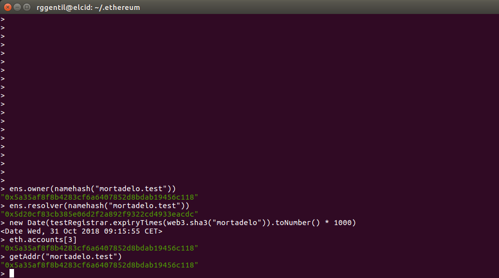
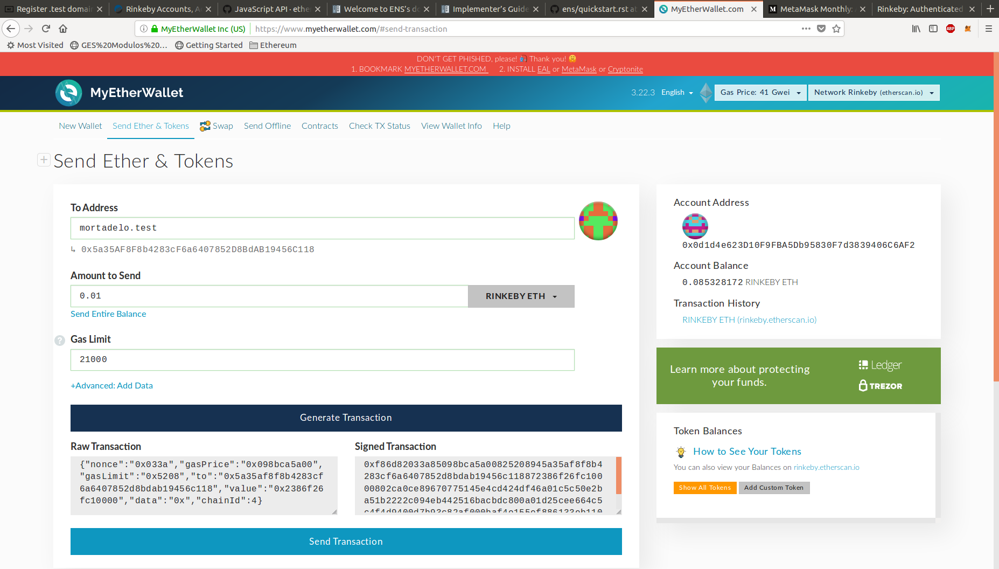

# Módulo 3 - Ejercicio 1 - ENS

## Adquiera un dominio bajo el TLD ‘.test’ en la testnet Rinkeby

Para este ejercicio lo primero que he hecho es sincronizarme con la red Rinkeby, con el modo "fast", aunque lo de *fast* es muy relativo ya que me ha tardado 3 días en ponerse al día con lo de las *state entries*.

Una vez ya sincronizado he podido realizar las tareas de este ejercicio. Comentar que me he basado en el siguiente tutorial para realizar el ejercicio: https://michalzalecki.com/register-test-domain-with-ens/. También en la página oficial de [ENS](http://docs.ens.domains/en/latest/index.html#), pero ésta última hacía más énfasis en lo relativo al *auction*, pero que en la testnet de Rinkeby no tiene lugar, por lo que es menos complicado y costoso de conseguir nuestro dominio deseado.

Para poder manejarnos con ENS necesitamos el script [ensutils.js](https://github.com/ensdomains/ens/blob/master/ensutils.js) que nos proporcionan en la página oficial de [ENS](http://docs.ens.domains/en/latest/index.html#), aunque en nuestro caso vamos a utilizar el script preparado para la red Rinkeby del tutorial anteriormente citado: [ensutils-rinkeby.js](https://gist.github.com/MichalZalecki/db02810da8e582d0494adb2c5fd31f3c#file-ensutils-rinkeby-js), donde se ha cambiado la dirección del Registry para adaptarlo a Rinkeby. 

Una vez que nos descargamos el script lo podemos cargar en la consola de geth mediante:

```
> loadScript("./ensutils-rinkeby.js")
true
```

Una vez cargado el script podemos utilizar sus funciones para interactuar con ENS.

### Comprobar dominio

A continuación podemos mirar si el dominio deseado está libre. Si la siguiente función nos devuelve un 0 o un tiempo pasado, es que está libre.

```
> testRegistrar.expiryTimes(web3.sha3("mortadelo"))
0
```

Como vemos el dominio "mortadelo.test" está libre. Notar que el nombre se tiene que pasar como un hash con sha3, que es lo que se maneja realmente en ENS.

### Registrar dominio

Para registrar un domino primero tenemos que tener la cuenta desbloqueada en geth, en mi caso he utilizado la cuenta 3, que es la que tiene algunos ETH en Rinkeby:

```
> personal.unlockAccount(eth.accounts[3])
Unlock account 0x5a35af8f8b4283cf6a6407852d8bdab19456c118
Passphrase: 
true
```

Para registrar el dominio introducimos el siguiente comando:

```
> testRegistrar.register(web3.sha3('mortadelo'), eth.accounts[3], {from: eth.accounts[3]})
"0xaa25e4222a18a970db9d692eef0a1f791d9ad5c79af031c69b540522bee2a8bb"
```

De esta manera tan sencilla ya tenemos registrado nuestro dominio "mortadelo.test" en Rinkeby. Podemos comprobar que somos los propietarios, así como hasta cuándo:

```
> eth.accounts[3]
"0x5a35af8f8b4283cf6a6407852d8bdab19456c118"
> ens.owner(namehash("mortadelo.test"))
"0x5a35af8f8b4283cf6a6407852d8bdab19456c118"
> new Date(testRegistrar.expiryTimes(web3.sha3("mortadelo")).toNumber() * 1000)
<Date Wed, 31 Oct 2018 09:15:55 CET>
```

### Resolver

Como hemos mostrado, hemos conseguido ser propietarios de un dominio, pero de momento no resuelve a ninguna dirección. Para ello lo tenemos que linkarlo con un *Resolver*. En las redes Main y Ropsten existen Resolvers públicos, pero no en Rinkeby. Podríamos crear nuestro propio Resolver contract, pero por simplicidad vamos a utilizar el que nos indican en el tuturial, que viene con los métodos necesarios: [Rinkeby Resolver](https://rinkeby.etherscan.io/address/0x5d20cf83cb385e06d2f2a892f9322cd4933eacdc#code).

Nos creamos la variable publicResolver, que es una instancia del contrato citado anteriomente:

```
> publicResolver = resolverContract.at("0x5d20cf83cb385e06d2f2a892f9322cd4933eacdc")
{
  abi: [{
      constant: true,
      inputs: [{...}],
      name: "supportsInterface",
      outputs: [{...}],
      payable: false,
      type: "function"
  }, {
      constant: true,
      inputs: [{...}, {...}],
      name: "ABI",
      outputs: [{...}, {...}],
      payable: false,
      type: "function"
  }, {
      constant: false,
      inputs: [{...}, {...}, {...}],
      name: "setPubkey",
      outputs: [],
      payable: false,
      type: "function"
  }, {
      constant: true,
      inputs: [{...}],
      name: "content",
      outputs: [{...}],
      payable: false,
      type: "function"
  }, {
      constant: true,
      inputs: [{...}],
      name: "addr",
      outputs: [{...}],
      payable: false,
      type: "function"
  }, {
      constant: false,
      inputs: [{...}, {...}, {...}],
      name: "setABI",
      outputs: [],
      payable: false,
      type: "function"
  }, {
      constant: true,
      inputs: [{...}],
      name: "name",
      outputs: [{...}],
      payable: false,
      type: "function"
  }, {
      constant: false,
      inputs: [{...}, {...}],
      name: "setName",
      outputs: [],
      payable: false,
      type: "function"
  }, {
      constant: false,
      inputs: [{...}, {...}],
      name: "setContent",
      outputs: [],
      payable: false,
      type: "function"
  }, {
      constant: true,
      inputs: [{...}],
      name: "pubkey",
      outputs: [{...}, {...}],
      payable: false,
      type: "function"
  }, {
      constant: false,
      inputs: [{...}, {...}],
      name: "setAddr",
      outputs: [],
      payable: false,
      type: "function"
  }, {
      inputs: [{...}],
      payable: false,
      type: "constructor"
  }, {
      anonymous: false,
      inputs: [{...}, {...}],
      name: "AddrChanged",
      type: "event"
  }, {
      anonymous: false,
      inputs: [{...}, {...}],
      name: "ContentChanged",
      type: "event"
  }, {
      anonymous: false,
      inputs: [{...}, {...}],
      name: "NameChanged",
      type: "event"
  }, {
      anonymous: false,
      inputs: [{...}, {...}],
      name: "ABIChanged",
      type: "event"
  }, {
      anonymous: false,
      inputs: [{...}, {...}, {...}],
      name: "PubkeyChanged",
      type: "event"
  }],
  address: "0x5d20cf83cb385e06d2f2a892f9322cd4933eacdc",
  transactionHash: null,
  ABI: function(),
  ABIChanged: function(),
  AddrChanged: function(),
  ContentChanged: function(),
  NameChanged: function(),
  PubkeyChanged: function(),
  addr: function(),
  allEvents: function(),
  content: function(),
  name: function(),
  pubkey: function(),
  setABI: function(),
  setAddr: function(),
  setContent: function(),
  setName: function(),
  setPubkey: function(),
  supportsInterface: function()
}
```

Definimos dicho resolver contract como el resolver de nuestro dominio recién adquirido:

```
> ens.setResolver(namehash("mortadelo.test"), publicResolver.address, {from: eth.accounts[3]})
"0x0aab118c13aeabac5cf97ad70edd629ba699a06dbf8026276833502434f8d1ef"
> 
> ens.resolver(namehash("rodrigo.test"))
"0x5d20cf83cb385e06d2f2a892f9322cd4933eacdc"
```

Ya solo nos falta apuntar nuestro dominio a la dirección que queramos usando el método setAddr del Resolver contract. En nuestro caso va a apuntar a la dirección que es el owner del dominio (eth.accounts[3]), pero podríamos haber usado cualquier otra. Como vemos el dominio "mortadelo.test" no apuntaba a ninguna dirección, una vez introducido el comando y que se ha minado vemos como se resuelve el dominio a nuestra cuenta. El contrato también muestra como se resuelve el dominio:

```
> getAddr("mortadelo.test")
"0x0000000000000000000000000000000000000000"
> publicResolver.setAddr(namehash("mortadelo.test"), eth.accounts[3], {from: eth.accounts[3]})
"0xbcc0d6336923ba69bf72e9afcfd8439bfe00ab253818668ade29027ada37a772"
> getAddr("mortadelo.test")
"0x0000000000000000000000000000000000000000"
> getAddr("mortadelo.test")
"0x5a35af8f8b4283cf6a6407852d8bdab19456c118"
> publicResolver.addr(namehash("mortadelo.test"))
"0x5a35af8f8b4283cf6a6407852d8bdab19456c118"
```

A continuación una captura con los datos de nuestro dominio "mortadelo.test":



### Usando ENS

Por último vamos a utilizar dicho dominio. Para ello vamos a enviar unos ETH a "mortadelo.test". Podríamos realizar una transferencia desde geth pasando la dirección que devuelve `getAddr("mortadelo.test")`, pero vamos hacerlo de manera más visual. Desde Metamask no veo que me deje introducir direcciones de ENS, pero con MyEtherWallet (en red Rinkeby) sí que se permite como vemos en la siguente imagen:



La transferencia se realiza [correctamente](https://rinkeby.etherscan.io/tx/0x2cb3d1e1770af6ef1ebd7aaa9fb427464307a7b865df9f5c541c5412292f9ae1) y me llegan los 0.01 ETH enviados