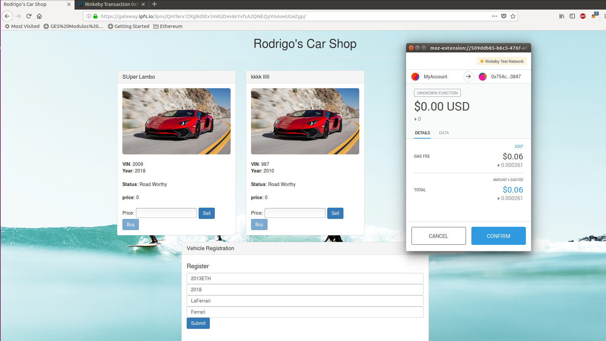
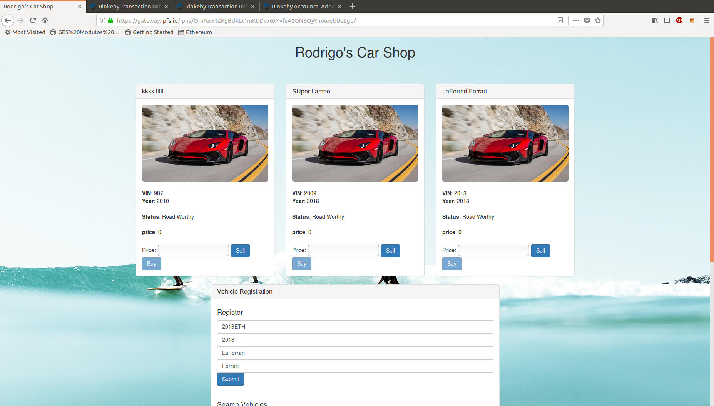

# Módulo 3 - Ejercicio 2 - IPFS

## Alojar una DApp en IPFS

### Desplegar los contracts

Para este ejercicio he utilizado una DApp muy sencilla, [Car Marketplace dapp](https://github.com/christinto/ChrisPerry_FinalProject_Consensys), que he encontrado en GitHub pero que servirá para el próposito que nos piden. He modificado el título y el texto a mostrar como nos indican, el proyecto completo se encuentra en ["rodrigos car marketplace"](rodrigos_car_marketplace). Comentar que había intentado utilizar la del tutorial de pet-shop pero no me cargaba bien la página todos los elementos a menos que lo lanzara con `npm run dev`, así que entiendo que será alguna cosa de front end que no acabo de controlar.

He desplegado los contratos con truffle en Rinkeby, haciendo un `truffle compile` y a continuación un `truffle migrate --network rinkeby`. Se puede consultar el fichero [truffle.js](rodrigos_car_marketplace/truffle.js) utilizado donde se especifica los parámetros a utilizar con Rinkeby, como la address usada en el despliegue (address que tenemos que desbloquear en geth console para poder ser utilizada).

Una vez hecho esto ya tenemos nuestros contratos subidos a Rinkeby.

```bash
rggentil@elcid:~/Documents/rodrigos_car_marketplace$ truffle migrate --network rinkeby --reset
Using network 'rinkeby'.

Running migration: 1_initial_migration.js
  Replacing Migrations...
  ... 0x7418f21bcb71e752950fce77f5a6985754be78670100d962c3e5b90d2f25e449
  Migrations: 0x3d228ec29b26bd8cfeb0cf21468905972590ccf7
Saving successful migration to network...
  ... 0xc50c5965bc38be37dfafc10b7001121665ecf1bec73842bd07449deeb2aa4b0d
Saving artifacts...
Running migration: 2_deploy_contracts.js
  Replacing VehicleManager...
  ... 0x7b399bec407b11a43395935e50d6a828d838225653487d0af4418c5b0591d910
  VehicleManager: 0x754c10d32fb7d53210938f6161087fc92db60847
Saving successful migration to network...
  ... 0xd047f0555433ae52d6e27bf079f70276257a4b3447ffa62fde50a50ddf35ccc3
Saving artifacts...
```

Podemos consultar el contract en etherscan:
https://rinkeby.etherscan.io/address/0x754c10d32fb7d53210938f6161087fc92db60847 

### Iniciar IPFS

Lo primero que tenemos que hacer es instalar ipfs para lo que seguimos lo que nos indica la web de [ipfs](https://ipfs.io/).

Para iniciar ipfs ejecutamos los siguientes comandos:

```
ipfs init
ipfs daemon
ipfs swarm peers
```

### Subir a IPFS

A partir de aquí ya podemos subir nuestra Dapp a IPFS. Comentar que lo que tenemos que subir sería el front end, la parte de JavaScript y los ficheros json que nos ha generado `truffle compile`. Recordadmos que la parte de los contracts es lo que se subía en el anterior apartado a la blockchain, en este caso a la red Rinkeby.

Para nuestro caso nos vamos a crear una carpeta *dist* que contiene tanto la carpeta *src* como los *builds/contracts* generados con el `truffle migrate`.

A continuación añadimos dist a ipfs:

```bash
rggentil@elcid:~/Documents/rodrigos_car_marketplace$ ipfs add -r dist/
added QmP2BYLVmDkkEnUCt2ui9MtXJXcZ9stGD7unmLSWnTcDD1 dist/CircuitBreaker.json
added QmfMwdoCzp5Xr7E2tYSANspQHm9h82JNxchqGHsqh7faAk dist/Migrations.json
added QmT6zauFKRFRxySa55cB243XGp9fr7kyCUG97zbbAmMsYF dist/Owned.json
added QmbEdYXqrzHd8QXagdvFonZ9DpcfWUU9tVZ3nFPMdfYDLe dist/SafeMath.json
added Qme9jnXoLzSWjC6VD4MXQZ24thDRvYWaWdFS1JtmCR82zu dist/VehicleManager.json
added QmYUaCPwvJWiueRXFSTTv8vdedWWzRhRdn8RMw35e7k67u dist/css/bootstrap.min.css
added QmbrzMumAwEPCoLs6jBdDyHz2TBjpkSFhcCHMT7fBsdFyr dist/css/bootstrap.min.css.map
added QmWhoNhVUb9bcjuKLB259VYogJpPsJaAe8dern9LK95tVN dist/fonts/glyphicons-halflings-regular.eot
added QmbcbjLEC1aHy4j2qvtncevjenYwHjEF4qZ2kK5pRJzDLg dist/fonts/glyphicons-halflings-regular.svg
added QmciDEkreBpY2S6Ktg1Zarbsx5K2DmHK59H261Bjr2fnuR dist/fonts/glyphicons-halflings-regular.ttf
added QmaYEdLkMnEHVN8HZB2GGETottySZoHh3TnYZERke36PVr dist/fonts/glyphicons-halflings-regular.woff
added QmUbUsBQbjJhm5iYba5jqibRr4A6gG3HVczSy5gs5PrMhY dist/fonts/glyphicons-halflings-regular.woff2
added QmUrgQUgDAM2phJnuemywgGeEJXYRcnaoHGDK8mrpd4WAM dist/img.jpg
added QmU3bcM8wcKwrHT586uMvnKNv7tkrSV3B7R1rY7JLr9tL9 dist/index.html
added QmbdFUaW74E9cm7MPy36suCpKnHvG1FX4v2cFp6deDH7Vp dist/js/app.js
added QmNXRFREw7waGtKW9uBUze3PkR9E12HeeAQSkZQSiFUJqo dist/js/bootstrap.min.js
added QmY23MrQmDKDmVsqkA6seWZko34tbvPBXgzuqwt2VMV4mn dist/js/hd-blue-background-wallpapers-1.jpg
added QmW5qd5uHjzK5JnEkXJ5LzpYaNTna2xY4k5myZKF9hUzJL dist/js/truffle-contract.js
added QmdTtsVM7KtvycQ68f9M43N4EQKvbd58q8aeAhP2fMz4Di dist/js/web3.min.js
added QmQfwrATTrJc1aTN1dVu9K7nQ5rw67np8yg46EvAbqKEZw dist/css
added Qmb3fJpXVGvUnNeRLC3P5sTXMzjpf5zq4tKt9XjhtYFf1k dist/fonts
added QmNeT1wnxbH7B87D6154uvhC48whf1PgToDxmV1be7D5bd dist/js
added QmRK7Vr5jTiPkeLuVxLFgmmL2D7ULVdnjczRsqic3n98qH dist
```

Y lo publicamos en IPFS para que nos resuelva con ipns:

```bash
rggentil@elcid:~/Documents/rodrigos_car_marketplace$ ipfs name publish QmRK7Vr5jTiPkeLuVxLFgmmL2D7ULVdnjczRsqic3n98qH
Published to QmTerx1ZKgBdXtx1mKUDex6xYvfsA2QNEQyYmAoeUUeZgp: /ipfs/QmRK7Vr5jTiPkeLuVxLFgmmL2D7ULVdnjczRsqic3n98qH
```

Podemos consultar nuestra DApp accediendo desde el navegador y poniendo la url con el hash que nos acaba de devolver:

https://gateway.ipfs.io/ipfs/QmRK7Vr5jTiPkeLuVxLFgmmL2D7ULVdnjczRsqic3n98qH/

o con ipns:

https://gateway.ipfs.io/ipns/QmTerx1ZKgBdXtx1mKUDex6xYvfsA2QNEQyYmAoeUUeZgp/

Comentar que la verdad que ipfs tarda bastante en cargar, a veces minutos por lo que puede ser un poco deseperante.

También comentar que IPFS permite utilizar ENS. Podríamos asociar nuestro contenido a una dirección de ENS y acceder al contenido desde el navegador con esta dirección ens, que resolvería Metamask. Desgraciadamente esta opción no funciona con las direcciones .test de Rinkeby.

### Interactuamos con la DApp

Una vez que se carga el front end de la DApp en nuestro navegador podemos interactuar con ella a través de Metamask como cuando la desplegábamos en local.




Podemos consultar [aquí](https://rinkeby.etherscan.io/tx/0xfddd60a038a14f6b18b1be840e843182511645c5434a121a2fac78002f6d78e3) una transacción con ella en etherscan.

También podemos ver como se han ido generando las transacciones en el smartcontract: https://rinkeby.etherscan.io/address/0x754c10d32fb7d53210938f6161087fc92db60847