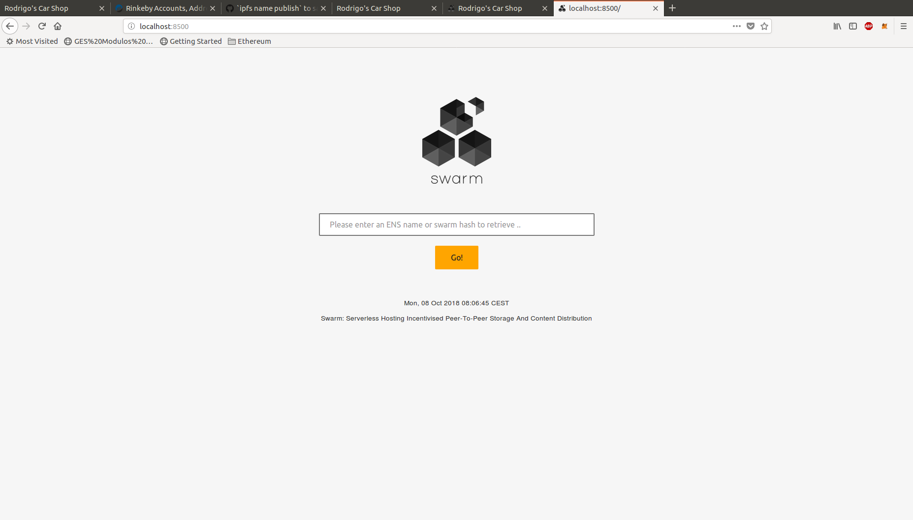
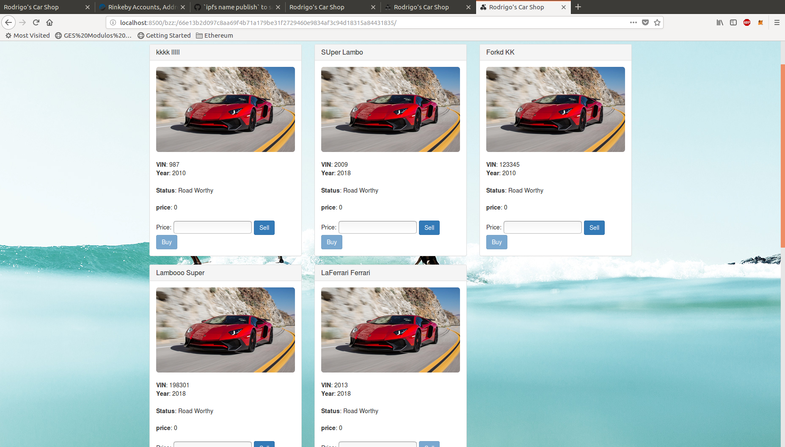
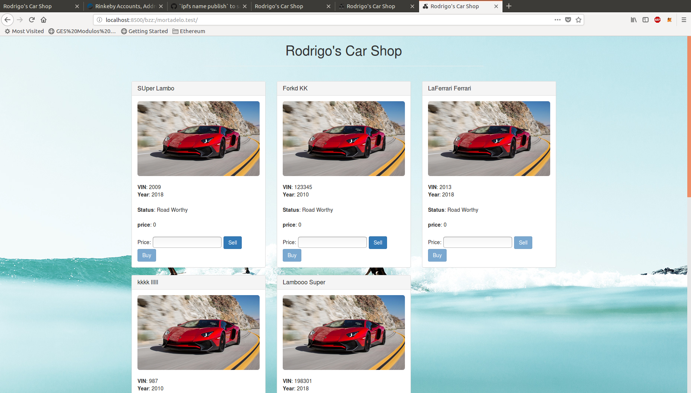
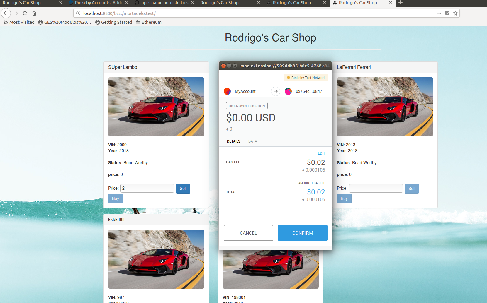
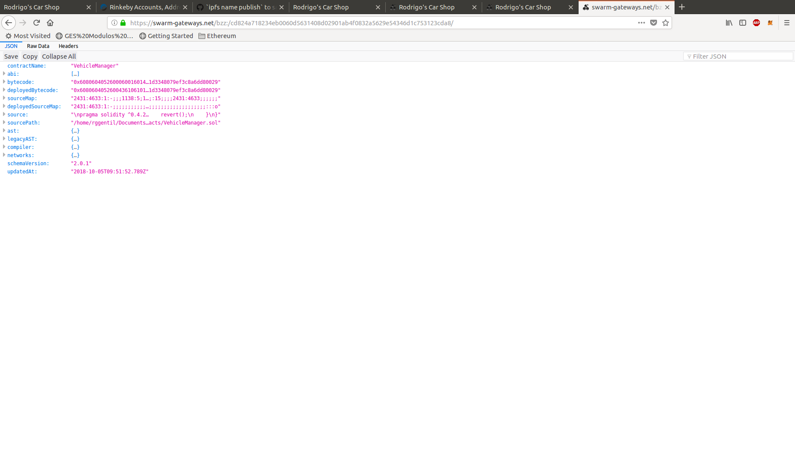

# Módulo 3 - Ejercicio 3 - Swarm

## Alojar una DApp en Swarm

### Desplegar los contract

Se va a utilizar los contratos usados para el ejercicio de IPFS por lo que no tenemos que hacer nada especial para éste.

### Iniciar Swarm

Lo primero que hay que hacer es instalar swarm para lo que seguimos los pasos que nos indican en la web oficial de [swarm](https://swarm-guide.readthedocs.io/en/latest/installation.html).

Concretamente en nuestro caso que usamos Ubuntu 16.04 ejecutamos los siguientes comandos:

```
sudo apt-get install software-properties-common
sudo add-apt-repository -y ppa:ethereum/ethereum
sudo apt-get update
sudo apt-get install ethereum-swarm
```

Una vez instalado tenemos que asociar una cuenta con swarm, que en mi caso utilizaré la misma cuenta usada en el resto de ejercicios. También indicamos con *datadir* donde se encuentra nuestro directorio de la blockchain, que en nuestro caso va a ser de nuevo la red de pruebas Rinkeby:

```bash
swarm --datadir=$HOME/.ethereum/rinkeby --bzzaccount 0x5a35af8f8b4283cf6a6407852d8bdab19456c118
```

Podemos comprobar que está funcionando accediendo a http://localhost:8500/:



No obstante para trabajar con swarm para que nos funcione ENS en Rinkeby debemos inicar swarm indicando la dirección del Registry de ENS de Rinkeby:


```bash
swarm --datadir=$HOME/.ethereum/rinkeby --bzzaccount 0x5a35af8f8b4283cf6a6407852d8bdab19456c118 --ens-api "test:0xe7410170f87102df0055eb195163a03b7f2bff4a@$HOME/.ethereum/rinkeby/geth.ipc"
```

### Subir a Swarm

Para trabajar con swarm seguimos los pasos de la página oficial: https://swarm-guide.readthedocs.io/en/latest/up-and-download.html

Concretamente, vamos a subir la DApp utilizada en el anterior ejercicio. Notar dos cosas de la siguiente instrucción:

- Utilizamos la opción `---defaultpath`: esto es para que al acceder directamente con el navegador al contenido subido de la DApp acceda al *index.html*. Esto difiere un poco de IPFS que era capaz de manejarlo sin indicar el archivo de entrada. Si no indicamos el html de entrada no podremos acceder desde el navegador con el hash (o ENS), habría que especificar *\<hash>/index.html*.
- Utilizamos la opción `--recursive`, para subir un directorio (en IPFS se usaba `-r`).

```
rggentil@elcid:~/Documents/rodrigos_car_marketplace$ swarm --defaultpath dist/index.html --recursive up dist
66e13b2d097c8aa69f4b71a179be31f2729460e9834af3c94d18315a84431835
```
El hash/manifest para acceder es lo devuelto de la anterior instrucción:
66e13b2d097c8aa69f4b71a179be31f2729460e9834af3c94d18315a84431835

Podemos acceder a nuestra DApp através de la dirección http://localhost:8500/bzz:/66e13b2d097c8aa69f4b71a179be31f2729460e9834af3c94d18315a84431835/

Como seguimos usando la misma DApp, al utilizar el mismo smartcontract, podemos ver como nos muestra lo que habíamos trabajado del anterior ejercicio de IPFS:



Una vez subido también podremos acceder al contenido usando `swarm down`. Por ejemplo para bajar un archivo en particular:

```bash
rggentil@elcid:~/Documents/rodrigos_car_marketplace$ swarm down bzz:/66e13b2d097c8aa69f4b71a179be31f2729460e9834af3c94d18315a84431835/VehicleManager.json my_contract.json
rggentil@elcid:~/Documents/rodrigos_car_marketplace$ diff dist/VehicleManager.json my_contract.json 
rggentil@elcid:~/Documents/rodrigos_car_marketplace$ 
```

Igualmente podemos bajarnos todo el directorio subido usando la opción `--recursive`:

```
rggentil@elcid:~/Documents/rodrigos_car_marketplace$ mkdir my_dapp
rggentil@elcid:~/Documents/rodrigos_car_marketplace$ swarm down --recursive bzz:/66e13b2d097c8aa69f4b71a179be31f2729460e9834af3c94d18315a84431835 my_dapp/
rggentil@elcid:~/Documents/rodrigos_car_marketplace$ ls dist/
CircuitBreaker.json  fonts    index.html  Migrations.json  SafeMath.json
css                  img.jpg  js          Owned.json       VehicleManager.json
rggentil@elcid:~/Documents/rodrigos_car_marketplace$ ls my_dapp/
CircuitBreaker.json  fonts    index.html  Migrations.json  SafeMath.json
css                  img.jpg  js          Owned.json       VehicleManager.json
```

### Swarm y ENS

Ya hemos visto como podemos acceder en Swarm a nuestra DApp con el hash generado. Sería más interesante poder acceder con una dirección sencilla que nos proporciona ENS. Para ello lo primeo que tenemos que hacer es obtener un dominio, tal como se especificó en [Ejercicio1-ENS](https://github.com/rggentil/master_ethereum/tree/master/design_and_development/modulo1/ejercicio1-ens).

A continuación debemos asociar nuestro contenido (através del hash, anteponiendo '0x') con nuestro dominio, usando la siguiente instrucción desde geth:

```bash
> publicResolver.setContent(namehash("mortadelo.test"), '0x66e13b2d097c8aa69f4b71a179be31f2729460e9834af3c94d18315a84431835', {from: eth.accounts[3]})
"0xd142d7feedd00cdcf26208593505665464409a9bb70087fad68be8f4506fc9f7"
```

Ahora podremos acceder a nuestro contenido desde una más amigable dirección: http://localhost:8500/bzz:/mortadelo.test/



### Interactuamos con la DApp

Una vez que se carga el front end de la DApp en nuestro navegador podemos interactuar con ella a través de Metamask.



Podemos consultar [aquí](https://rinkeby.etherscan.io/tx/0xcf35eef85b64aa394b39d3bb1b52c2eb60de4f1e373a4ea2bda706c10635b104) una transacción con ella en etherscan.

También podemos ver como se han ido generando las transacciones en el smartcontract: https://rinkeby.etherscan.io/address/0x754c10d32fb7d53210938f6161087fc92db60847

### Subir a un nodo remoto

El contenido subido ahora mismo solo estaría para consultar en local. También tenemos la opción de subir a un nodo remoto nuestra DApp. Existe un nodo swarm gateway para probar, aunque tiene un tamaño limitado de subida por lo que no podemos subir ahí nuestra DApp:

```bash
rggentil@elcid:~/Documents/rodrigos_car_marketplace$ swarm --recursive --defaultpath dist/index.html --bzzapi https://swarm-gateways.net up dist/
Fatal: Upload failed: unexpected HTTP status: 413 Request Entity Too Large
```

Subimos un contract para ver simplemente que funciona:

```bash
rggentil@elcid:~/Documents/rodrigos_car_marketplace$ swarm --bzzapi https://swarm-gateways.net up dist/VehicleManager.json 
cd824a718234eb0060d5631408d02901ab4f0832a5629e54346d1c753123cda8
```

Podemos acceder a dicho contract desde https://swarm-gateways.net/bzz:/cd824a718234eb0060d5631408d02901ab4f0832a5629e54346d1c753123cda8/

