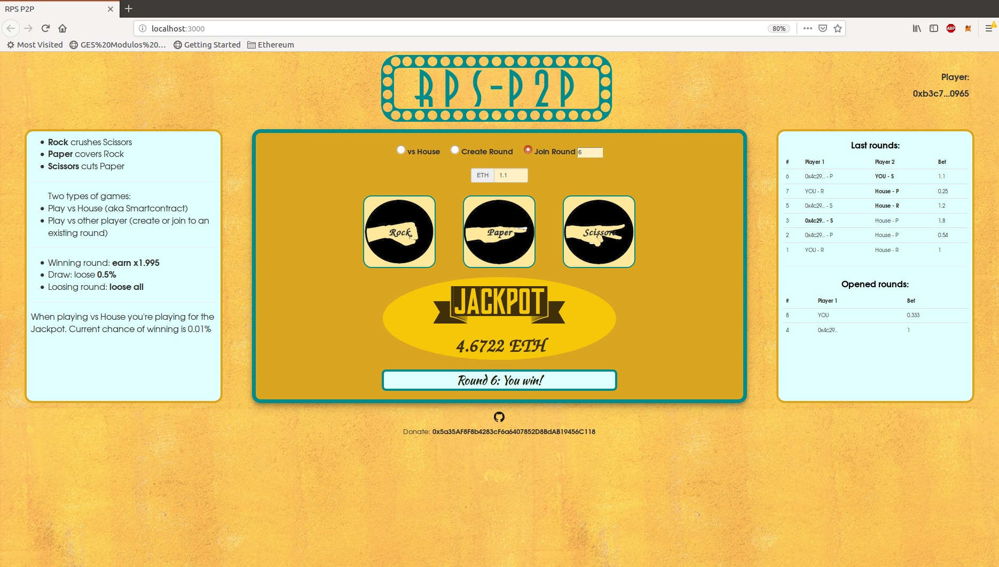

# RPS

Simple implementation of the popular game of Rock-Paper-Scissors, to create a DApp in Web3 and Solidity for Ethereum.

You can place bet against the house/jackpot and also create rounds that anyone can later join.



## Instructions

First of all, the owner of the contract, that is the creator if we haven't change it, needs to perform two actions:

- Fund the game: we need to send some ETHs to the contract that go to the jackpot so anyone can play with it (minium jackpot is 1 ETH). We can do it by calling *fundGame()* or by sending value wieth transfer/send that invokes the fallback function.
- Start game by calling function *startGame()*. This also starts lottery game.

Please, take into account that for these two actions we have to do it through console (or Remix), since I haven't implemented them in the front-end.

For instance, we can run following instructions from truffle console (if we have deployed the contract):

```javascript
fundGame = (account, ethers) => RPS.at(RPS.address).fundGame({ from: web3.eth.accounts[account], value: web3.toWei(ethers) })

fundGame(0,5)

RPS.at(RPS.address).startGame()
```

We can play RPS in two different ways:

### Playing vs House

In this way you can play like if you were playing vs the House (similar to a Casino) but in fact you are just playing vs the smartcontract, in a decentralized way. You set the amount you want to play, choose your option among Rock, Paper or Scissors and wait for the result, that can be a win, a lost or a draw. The result is shown and the round is displayed in the history table "Last rounds" (only last 8 last rounds are displayed). If you win, you get the amount bet minus a fee, if you draw you pay that little fee and if you lose you lose your bet.

Apart of this classic way of playing RPS when you place a bet vs the House you're also playing for the jackpot, that works as a lottery-style, being each round a change of hitting the jackpot. The jackpot is funded both by funding game function and by fees of each round. Lottery is set now as a chance of winning of 1/1000. For a real deploy we should consider a deeper analysys including the suitable of the percentage of fees and chance of winning.

### Playing vs other player (P2P gaming)

In this way you play vs another oponent. In this kind of game we can play by:

- Creating a new round: set the amount you want to bet and choose your RPS option. Then a new round has been created and you need to wait for someone who joins to that round to finish the game.
- Join to an existing round: if other player has already created a round you can just join to that round. You can see the rounds waiting for players to join to on the right table "Opened rounds". You can play by providing the round ID number, betting a bet amount equal or higher than the amount of the opened round (if you place a higher amount you get back the exccess of bet) and choose your RPS option. The result is shown, the round is removed from "Opened rounds" table and the result of the game shows up in the "Last round table". The winner earns the bet amount minus a fee, the loser loses the bet amount and in case of draw both players pay the little fee.

Lottery is not able for this type of game because a simple attack would be to create rounds and join ourselves and wait to hit the jackpot. We should proabably need to set other fee that wouldn't go to the jackpot so playing more times wouldn't be actuallty an advantage.

## About source code

### Front-end

This Dapp has a simple front-end, I actually based it in the truffle-box pet-shop, so it may contain some extra files that we don't realy need. The front-end is just an [HTML file](src/index.html), a [CSS file](src/css/main.css) and a [JavaScript (ES6) file](src/js/app.js). As far as I know it also uses lite-server for the web page. In order to launch front end run:

    npm run dev

The most interesting part from the point of view of the PEC is the use of web3js, the JavaScript library for connecting Solidity/Ethereum with JavaScript/Front-end. I've used again TruffleContract to get the info of the contract and instantiate the contract for interacting with it.

Due to my lack of knowledge I haven't used any popular framework (like Vue or React). Also I don't know very well the needed node_modules, so there are probably several modules that are not used in this App. This is my first web page, so please consider my limitations :)

### Back-end

Back-end is coded in Solidity, the most popular language for working with Ethereum. I'd like to comment several things about this code:

- I might be using many variables and methods, and I'm sure that the code could be optimized in order to save same gas both on deploying contract and using it. But since this is just a PEC, and the use is either in a local blockchain or testnet where we don't spend "real money" (aka ethers) I haven't focused too much in gas saving, although I've tried to do my best.
- Since we have to use a library for this PEC I've used the OpenZeppellin's library SafeMath, that assures that for arithmetic operations we don't get unexpected results becasue of overflows or underflows. Note that I've used only in some parts since in other parts I haven't considered it necessary. Besides using a library affects gas by increasing it. For a real deploy we might consider to do a further analysis, but I think that we might put aside the use of this library.
- For the inheritance I've used one of the most famous contracts, OpenZeppellin's Ownable, that help us to handle everything about owner, transfer ownership, renounce ownership and use *onlyOwner* modifier.
- As a *circuit breaker/emergency stop* I've implemented the functions *stopGame/startGame* along with *withdrawFunds*, so in case of having an attack the owner can put the funds in a safe address. Note that this also allows the owner of the contract of stealing the funds at anytime, so in a real deploy either we are a respect agent/company or we should renounce ownership so none could withdraw funds, in spite of having an attack.
- There are some variables like *maxJackpot* or *businessFee* that haven't finally implemented and in a real deploy we should to avoid some kind of attacks (in gambling you have to set a maximum bet to avoid the typical attack of betting the double each time), but once again, just for the PEC I haven't implemented. Other parameters like lottery rate, jackpot fees, etc are set but without studing deeply the best value. We could also set these params in the constructor in order we could deploy different games.

All functionality is managed in one file: [RPS.sol](contracts/RPS.sol).

## Security <a name="security"></a>

We already know that security is one of the most important issues when dealing with smartcontracts, since any potential bug can turn into a lose of funds. Moreover, in a casino-style game, there are some assumptions about our solution that can become a real mess.

Some approaches for security:

- Use SafeMath library for some arithmetic operations to avoid overflows and underflows.
- Use Ownable contract and *onlyOwner* modifier to restrict the use of some methods to only the onwer.
- Use always *transfer* instead of *send* in order to avoid reentrancy attacks.
- No use of *delegateCall* that could allow a potencial attack.

However this Dapp has some important vulnerabilities that makes it unappropiate for a real deploy in the mainnet. Here they are:

### Getting randomness

The problem is that for gambling (both choosing option for the House and for the lottery)  we need a trustful source of randomness but at the same time we can't get randomness in a deterministic blockchain like Ethereum (at least so far). So there is simple no way that we can get randomness without reaching outside of the blockchain. I'd need having implemented an oracle for achieving randomness. The fact is that I haven't becasue of this is just a PEC and in local and testnet chains, but for a real deploy it should be cumpolsory. I just get randomness from hash of the last block, but this has vulnerabilities. So, we could attack this DApp in two ways:

- By creating a contract whose RPS option is based in the hash of the last block to choose the option that always beats the House. We could create a contract that it alwasy win the round vs the house.
- Lottery is also based in hash of the last block, so miners could mine in order to hit the jackpot, so they could discard blocks where their round doesn't get the jackpot and only publish when they are the winners. Note that this attack wouldn't be interesting if the jackpot were lower than mining reward (3 ETHs). In order to deploy the DApp in the real world a further analysis is needed.

### Possible to see option of Opened rounds

Ethereum is a public blockchain and all the info is stored in the chain and it can be accessed by any node of the Ethereum network. Then we can access any value of the game, although the variable is private, by call web3 function *getStorageAt* and adjust the parameter of its position in "memory" to get the value. This may sound not trivial but a hacker with some experience could do it, so this is again not safe to deploy this DApp in the real world. To avoid this issue we should have implemented a set and reveal pattern where we set the bet with our option with a secret word. This is hashed in the front-end, sent and stored in the blockchain so the attacker could not obtain the option. Then the opponent makes his/her bet in a classic way and then he/she waits the first player to send again the option with the secret word. If the hash matches we know it's the original choice. Also this solution needs to consider time limits for revealing the round, so it is not so automatically (maybe it could be automated in the front end), so this would need a further analysys.

## How to upgrade RPS DApp

I haven't created a mechanism to upgrade this DApp. However, here it is a mechanism to do it. There are other ways but this seems to be the most trendy.

We could use *delegatecall* to forward calls of our contract, acting as a proxy. We could have in our contract a method that simply sets the pointer to an address of the new and upgraded contract, so we could change this address to point to new contracts when we wish (only the owner would be able to do it). Note that we should consider very carefully to use *delegatecall* since there exist some potential vulnerabilities/attacks with this approach and we have to know very well too about storage memory between proxy and contract, since it's a bit messy for a non solidity expert.

Nevertheless I consider that if you want to create a decentralzied p2p gambling platform you should avoid to use the idea about upgrading the DApp. This is because it'd mean that the owner could at any time change the rules of the game, so it would become less trustworthy and in the end peple wouldn't just play it. On the other hand if we were a well known and respected gambling company the users could trust us and also that we could upgrade the contracts at any time. Even we could think about an upgrading pattern working as a king of a DAO of this gambling p2p, and the users could vote for upgradings. This may be a good approach but too complicated for this simple game (and for the PEC).

Finally the simplest approach would be forgetting at all about upgradability and just deploy a complete new contract when we want to add new games/functionalities. We don't really have to migrate data so for instance if someone hits the jackpot instead of funding again the game we could deploy a new contract and fund that contract with new features.

## Testing

Tests are included in [TestRPS.js](test/TestRPS.js). I've created several tests for this DApp, including unit tests that cover all non-private functions and also some basic functional tests that would cover all functions and the backend in general. All tests are in JavaScript, since it's much more versatile than solidity unit tests. Note that I haven't created tests for the javasctip front-end, since they were not required for the PEC.

Comments added in test file.

Here is the list of tests after executing *truffle test*:

```bash
  Contract: RPS
    ✓ Test fund game (837ms)
    ✓ Test start game (602ms)
    ✓ Test stop game (263ms)
    ✓ Playing vs the House (5109ms)
    ✓ Test getting info from round (vs House) (156ms)
    ✓ Playing 2 players (4665ms)
    ✓ Test getting info from round (2 players) (181ms)
    ✓ Test error when creating round with bet lower than minimum bet (175ms)
    ✓ Test error when joining to a non existing round (107ms)
    ✓ Test error when joining to a finished 1 player round (176ms)
    ✓ Test error when joining to a finished 2 players round (222ms)
    ✓ Test error when joining to a round sending lower bet amount (194ms)
    ✓ Test play lottery (playing vs House) (1127ms)
    ✓ Test error withdrawing when game is running (985ms)
    ✓ Test error withdrawing funds when not owner (779ms)
    ✓ Test withdraw funds (882ms)


  16 passing (17s)
```

## RPS-P2P on Rinkeby

RPS-P2P is a game not ready for productioh, so it is thought to be deployed in a local blockchain (just run `ganache-cli`) or also in a testnet like Rinkeby. The game has been deployed in Rinkeby with following contract address:

```bash
Crggentil@elcid:~/Documents/master_ethereum/design_and_development/modulo4/myda/RPS$ truffle migrate --network rinkeby
Using network 'rinkeby'.

Running migration: 1_initial_migration.js
  Deploying Migrations...
  ... 0xf20787b78e2d51f25aeb076ffab9f47b0249b664bfbe444820493ce06abc0c82
  Migrations: 0x1415401bd692d86b56387dc7fe0f7eb9f231548b
Saving successful migration to network...
  ... 0x8dba9ff0dbeaafa2b689b815646303875c537970ea9492a4cb8203c456591d68
Saving artifacts...
Running migration: 2_deploy_contracts.js
  Deploying RPS...
  ... 0x64a85428b14016ab89231462255b6c3ca84d3e9fff7edaecb8a614602fc70216
  RPS: 0x979a73188c6fb4668a218c53cf0101ca1f16be78
Saving successful migration to network...
  ... 0x9a1fce792416f217f25739b9c92f892db8b0264e7d86f9890b203a563d8f4231
Saving artifacts...
```

## Known issues

- There are some problems populating "Last Round" and "Opened round" tables when we manage rounds. It seems like several rows are added for the same round. Couriously this was something I got to solve for local chains but now it happens for Rinkeby. A simple workaround is to refresh the page.
- There are several issues about security, see [Security](#security).
- It is possible to lock opened rounds by betting and withdrawal all funds of the game, since we are managing only one jackpot that contains all the funds of the game.
